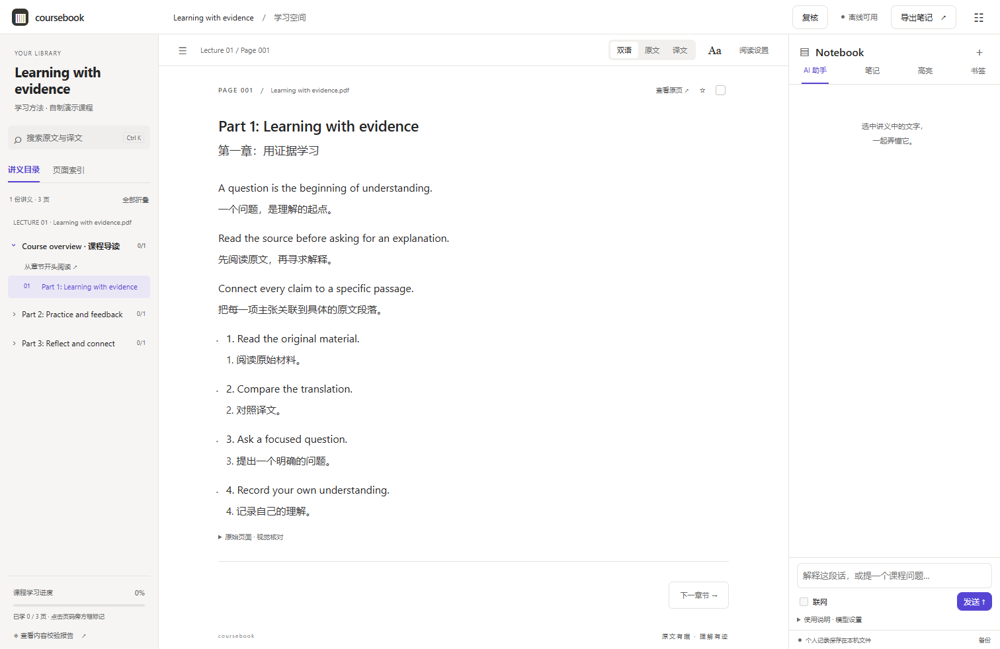
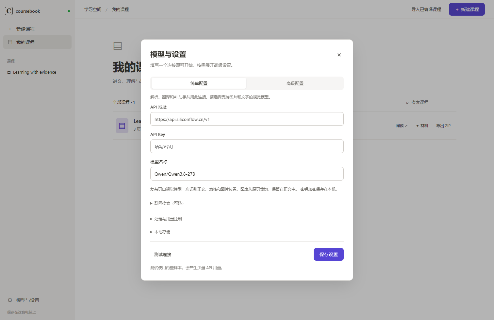

<div align="center">

# Coursebook

### 把课程讲义，变成可以读、查、问、记的双语学习空间。

PDF · PPTX · PPT → 完整原文 · 对照译文 · 原图表 · 按需 AI 助手

[下载 Windows 版](https://github.com/yunmyuki/coursebook/releases/tag/v2.0.0) · [快速开始](docs/quickstart.md) · [发布说明](docs/release-notes.md) · [反馈问题](https://github.com/yunmyuki/coursebook/issues)


</div>

Coursebook 是一款本地课程编译与阅读应用。导入一门课的多份讲义，生成按原页顺序组织、可追溯来源的双语学习网站。课程和学习记录保存在你的电脑上；导出的静态网站无需应用或后端即可阅读。

你有没有遇到过这些情况？

讲义是电子的，笔记是手写的，还需要翻来翻去；读到陌生术语，想看准确的译文，还需要复制翻译；遇到难懂的公式，想追问背后的直觉，还需要丢给AI；复习一个概念，想起当时写下的笔记，发现已经找不到了。学习一门课，需要这些动作不断衔接。

如果你遇到了，那儿Coursebook就是为你准备的。

**Coursebook 把阅读、检索、提问和记录放进同一个学习空间。** 导入一门课的多份 PDF、PPTX 或 PPT，它会将分散的讲义编译成按原页顺序组织的双语学习页面：左侧是课程目录，中间是逐单元对应的原文与译文，右侧是随时可用的 AI 助手和个人笔记。你可以沿着课程读下去，也可以从一个问题出发，找到原文、追问解释，再把理解记录在对应的位置。无需担心找不到位置，讲义与笔记均支持搜索。



## 下载

当前版本：**2.0.0 · Windows 10/11 x64**。精确文件大小与校验值见对应 Release 附件。

| 发行包 | 适合你，如果… | 下载 |
| --- | --- | --- |
| 完整版 · 403.8 MiB | 需要直接处理 PDF、PPTX、PPT，无需另装转换工具 | [Windows x64 ZIP](https://github.com/yunmyuki/coursebook/releases/download/v2.0.0/CourseCompiler-Windows-x64.zip) |
| 轻量版 · 52.7 MiB | 主要处理 PDF，或电脑已安装 LibreOffice | [Windows x64 Lite ZIP](https://github.com/yunmyuki/coursebook/releases/download/v2.0.0/CourseCompiler-Windows-x64-Lite.zip) |
| Office 组件 · 351.1 MiB | 想为轻量版补充 PPT/PPTX 转换能力 | [Office ZIP](https://github.com/yunmyuki/coursebook/releases/download/v2.0.0/CourseCompiler-Office-Windows-x64.zip) |
| 源码 · 约 1.6 MiB | 希望自行运行、修改或构建 | [Source ZIP](https://github.com/yunmyuki/coursebook/releases/download/v2.0.0/CourseCompiler-Source.zip) |


想先体验阅读？[下载自制示例课程](https://github.com/yunmyuki/coursebook/releases/download/v2.0.0/CourseCompiler-Demo.zip)，直接解压打开 `index.html`，或在应用中导入。示例译文为人工编写，无需 API 即可体验阅读。

解压整个文件夹，双击 `CourseCompiler.exe`。应用自带 Python；请保留 `_internal` 文件夹。窗口优先使用系统 WebView2，无法启动时会在默认浏览器打开本地界面。

## 从讲义到学习空间

1. **连接模型。** 默认只填写 API 地址、API Key 和模型名。共用模型需支持图片输入；高级设置可分别配置文档解析、翻译和 AI 助手。
2. **导入课程。** 拖入多个 PDF / PPTX / PPT，按文件顺序组织讲义。可靠文本直接提取；复杂页面交给视觉模型，保留原图、页码与位置。
3. **检查结果。** 对照原页复核疑点，修改原文或译文。保留原始识别文本与修改记录；暂停后可从缓存继续。
4. **阅读和提问。** 搜索内容、切换双语布局、选段向助手提问、记录笔记和高亮。
5. **导出带走。** 导出课程 ZIP，解压后打开 `index.html`。阅读、检索和浏览器内笔记无需后台服务。



## 让学习回到内容本身

### 读：把一页页讲义，读成一门连贯的课

保留课程的原始顺序，同时把幻灯片中的信息重新排版为适合长时间阅读的网页。你始终知道正在读哪份讲义、哪一页，也可以按自己的习惯调整阅读方式。

- **原文与译文，就在同一处。** 标题对应标题，段落对应段落，列表项和表格单元也尽可能逐一配对。支持左右对照与上下对照，并可随时切换双语、仅原文或仅译文。
- **课程细节留在正文里。** 尽可能保留列表层级、表格结构、公式、代码格式、注释和讲者备注。图表与图片提取后插入正文，从图表中识别的文字带有来源标记，便于结合原图理解。
- **翻译贴合这门课。** 编译时识别课程主题，为翻译提供学科与表达风格参考，并结合课程术语表保持专业词汇的一致性。翻译以完整对应原文为目标。
- **阅读节奏由你决定。** 折叠目录、切换字体、调整双语布局与内容密度，用章节进度记录学到哪里。辅助提示收在需要时可展开的位置，给正文更多空间。

### 查：找到知识，也找到它的出处

当你记得一个概念，却想不起它出现在哪一讲时，可以直接搜索；当你需要确认一句话的语境时，可以沿着来源回到原页。每次查找都能接回课程本身。

- **按课程顺序浏览。** 讲义、章节与页面组成层级目录，保留原始文件顺序和页码。点击即可跳转，当前阅读位置会在目录中高亮。
- **搜索原文和译文。** 通过全文搜索或 `Ctrl + K` 查找词语与相关内容，点击结果定位到对应正文，适合复习时跨章节查找。
- **从记录回到上下文。** 目录、搜索结果、笔记、书签和助手中的讲义引用使用统一定位方式。找到一条记录，就能回到它关联的原文位置。
- **随时核对原页。** 查看原文件、页面图像与正文来源，确认公式符号、图表细节，以及网页重排前的上下文。

### 问：带着当前正在读的内容，与 AI 一起理解

打开右侧 AI 助手，选中正文中的句子，再输入问题。所选内容会自动成为提问上下文，你可以从「这句话是什么意思」继续追问到「能不能举个例子」或「它和前面的概念有什么联系」。

- **选中即带入上下文。** 选段显示在输入框上方，可展开查看或移除，减少来回复制讲义的步骤。连续追问时，助手可以结合相关对话继续回答。
- **围绕问题检索课程。** 助手可以搜索当前课程的讲义内容，召回相关段落；回答中的讲义引用可点击返回正文，方便检查解释所依据的材料。
- **需要时延伸到外部资料。** 配置搜索服务并开启联网后，助手可查找外部资料，并提供对应来源链接。联网由你选择是否启用。
- **提问后再生成回答。** 不提前为整门课生成大量解析。等待时显示正在检索、联网查找或整理回答等状态，可主动停止；新回答不会强制打断你对历史消息的阅读。

助手回答清楚标记为 AI 补充说明，保持在独立区域。你可以对照讲义判断它是否有帮助，也可以把有价值的回答保存为笔记。

### 记：让理解留在它发生的地方

看到重要的一句就高亮，遇到疑问就记下，读完一节就记录进度。复习时，这些记录仍然和当时的讲义内容连在一起。

- **在右栏直接写笔记。** 针对正文段落、列表、公式、表格或图表等内容记录想法，编辑时仍能看到讲义，无需弹出另一个窗口。
- **用高亮与书签标记重点。** 高亮值得反复阅读的文字，为需要回看的页面添加书签，在个人工作区中集中查看。
- **把回答转化为自己的积累。** AI 回答可保存到笔记，保留引用信息，便于继续补充自己的理解。个人笔记与助手对话分别管理。
- **记录进度，也保留备份。** 章节进度帮助你接着上次的位置学习；笔记支持备份与导出，方便迁移和保存。

### 一门课可以持续更新，一套资料可以长期保留

**新讲义到了，接着加进来。** 课程建立后仍可追加材料，系统会建议插入位置，并展示加入后的阅读顺序。你可以调整新材料的顺序与位置，确认后再处理，让课程随着授课进度逐步完善。

**有疑点，就在原页旁边复核。** 对照原页检查识别结果，直接修改原文或译文。原始识别文本、内容位置和修改历史保留，方便理解一处内容是如何得到、又是如何修正的。解析错误可以被发现并修正，复杂页面仍需要你的判断。

**处理进度和请求用量可掌握。** 可靠文字页优先直接提取，扫描件、图表和复杂布局交给视觉模型解析；缓存已完成的结果，支持暂停和失败后继续。可设置请求次数上限，并分别配置解析、翻译与助手模型，按自己的需求选择效果和费用。实际金额取决于服务商计费。

**读完之后，资料仍属于你的学习空间。** 课程、笔记和助手对话以本地文件保存，无需远程数据库。课程可导出为 ZIP，解压后直接打开，无需运行应用或后台服务即可阅读、搜索和做浏览器内笔记。AI 助手与联网功能则在本地应用中使用；个人记录通过独立备份迁移。

## 模型和联网搜索

可配置兼容接口，包括 OpenAI 兼容格式与 Anthropic 格式。共用连接使用视觉模型；翻译和学习助手可以使用独立文本模型。提供硅基流动、通义、DeepSeek 等连接预设，实际可用性取决于服务商、模型能力和账户权限。

联网搜索是可选功能，支持**博查、百度千帆、Tavily、Exa、Brave、SerpApi**；SerpApi 可选择 Google、Bing、百度引擎。各服务独立保存密钥，可先测试连接。Google/Bing 搜索通过 SerpApi 接入，不表示支持已经停用或限制新注册的旧版官方搜索 API。

模型与搜索服务由你选择、配置和付费。应用暂时不提供模型服务。

## 本地保存与隐私

- Windows 发行版数据目录：`%LOCALAPPDATA%\Course Compiler`。课程、学习记录和助手对话在本地文件中保存，无远程数据库。
- API Key 使用 Windows DPAPI 加密，与当前 Windows 用户绑定。密钥不写入导出的课程网站。
- 编译和提问时，相关文字、页图、上下文会发送到你配置的模型服务。启用联网时，搜索词发送到你选择的搜索服务。
- 静态导出的课程包含讲义内容、原文件和页图；分享前请确认自己有权分享这些资料。个人笔记需要单独备份。

详见 [隐私与数据流](docs/privacy.md)。


## 开发

```powershell
git clone https://github.com/yunmyuki/coursebook.git
cd coursebook
python -m venv .venv
.venv\Scripts\Activate.ps1
python -m pip install -r requirements.txt
python -m course_compiler serve --port 8768
```

打开 `http://127.0.0.1:8768`，在页面中配置自己的模型。开发与构建基于 Python 3.12；源码模式的 PPT 转换需要 LibreOffice。

```powershell
New-Item -ItemType Directory -Force tmp
python -m pip install -r requirements-dev.txt
python -m unittest discover -s tests -p "test_*.py"
node tests/reader.test.cjs
```

[构建与发布指南](docs/development.md) · [报告问题](https://github.com/yunmyuki/coursebook/issues/new?template=bug_report.yml)

欢迎提交可复现的问题和改进建议。报告问题时请移除 API Key、私人讲义与学习记录。

## 许可证

项目代码使用 [MIT License](LICENSE)。第三方组件沿用各自许可证，包括 LibreOffice、PDFium、KaTeX、pywebview 与 Python。发行包保留第三方许可证和来源说明，见 [第三方组件](docs/third-party.md)。项目与这些组件的维护组织无隶属或背书关系。

页面截图使用项目自制示例，不包含用户课程资料。
